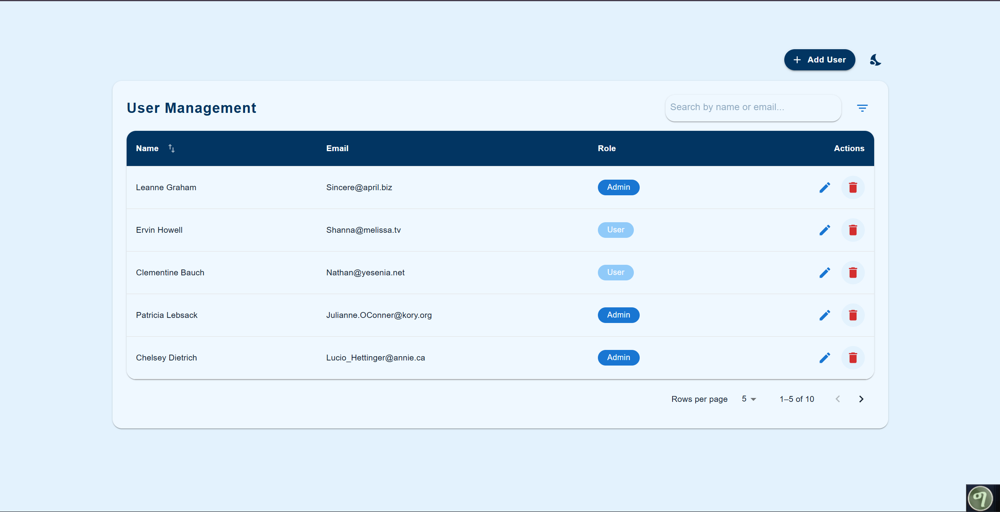

# React TypeScript Intern Assignment — User Dashboard

A modern React + TypeScript user dashboard built as an intern assignment.

Key features

- React + TypeScript
- Material UI v5 theming (light/dark)
- LocalStorage-backed persistence
- CRUD for users (Add / Edit / Delete)
- Client-side pagination, sorting (name-only), and filtering by role
- React Query and React Router available in workspace (some files scaffolded)

Repository structure (important folders)

- user-dashboard/
  - public/ — static assets
  - src/
    - core/ — constants and utilities
    - data/ — data sources and repository implementations
    - domain/ — entities, repositories, use-cases
    - presentation/
      - components/ — UI components (UserTable, UserForm, ConfirmationDialog, etc.)
      - hooks/ — custom hooks (useUsers, React Query hooks)
      - pages/ — top-level pages (UserPage)
    - App.tsx — app entry (theme provider, router)

Getting started (local)

1. Install (from repo root):

```powershell
cd user-dashboard
npm install
```

2. Run the dev server:

```powershell
npm start
```

3. Build for production:

```powershell
npm run build
```

Notes

- The project stores user data in localStorage for persistence.
- Client-side pagination and name-sorting are implemented in `UserTable.tsx`.
- The theme toggle in `UserPage.tsx` switches between light/dark modes and shows icons for the current mode.

Developer notes

- To add server-side pagination, migrate `useUsers` to accept page/limit and fetch per-page with React Query.
- If you undo my changes, keep an eye out for duplicate imports/exports in `UserTable.tsx` (this file had earlier merge issues).

Next steps you may want

- Add tests for domain/usecases and components
- Implement server-backed APIs and replace localStorage
- Add React Query pagination and caching

License
MIT


